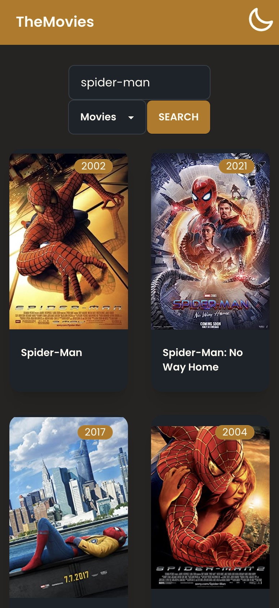

# The Movies

  

This project was generated with [Angular CLI](https://github.com/angular/angular-cli) version 16.1.4.

## Prerequisites

Make sure you have the following installed on your system:

Node.js (version 18.16.x or higher)  
npm (version 9.7.x or higher)

## Setup

- Before everything run `npm i` to install dependencies
- To start the dev server type: `npm run start`
- To build the app for production type: `npm run build`

Pushing to `main` branch publishes changes to this [page](https://main--warm-sundae-3c499d.netlify.app/)

## Functionalities

- Search for movies or series in the main page using the search pare at the top of th page.
- Scroll down to load more movies/series
- Click on any movie/series and view its details
- Load the page in your phone and install it as PWA

## Screenshots

